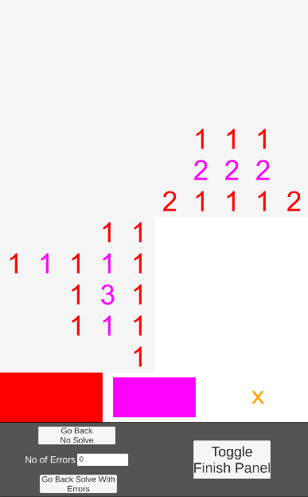
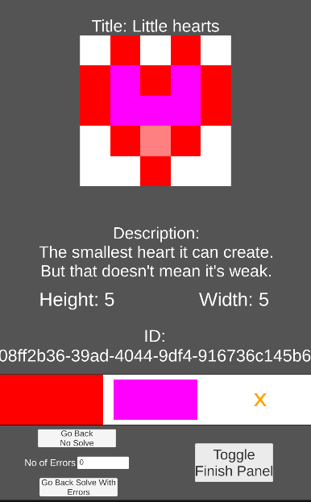
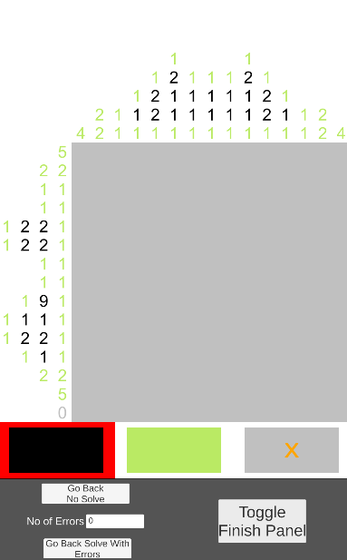
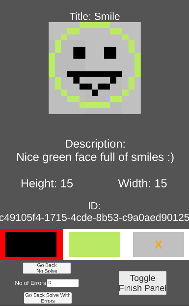

# Logic Picture - Unity Game
 Logic picture puzzle game. Your goal is to color grid according to number on the side. Level editor for this game you can find here: https://github.com/bertekg/LogicPicture_LevelEditor. This game is developed in Unity.

## Screenshots

### 1. Level 'Little heart 5x5' at begining

### 2. Level 'Little heart 5x5' after solve

### 3. Level 'Smile 15x15' at begining

### 4. Level 'Smile 15x15' after solve

